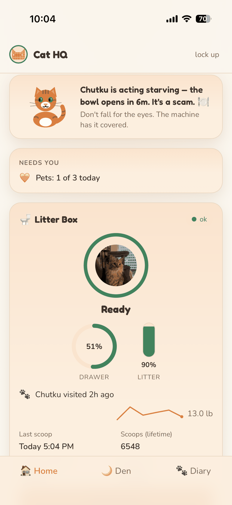
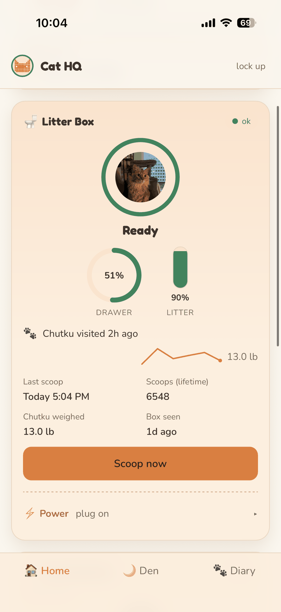
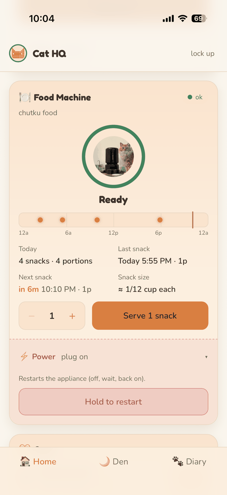
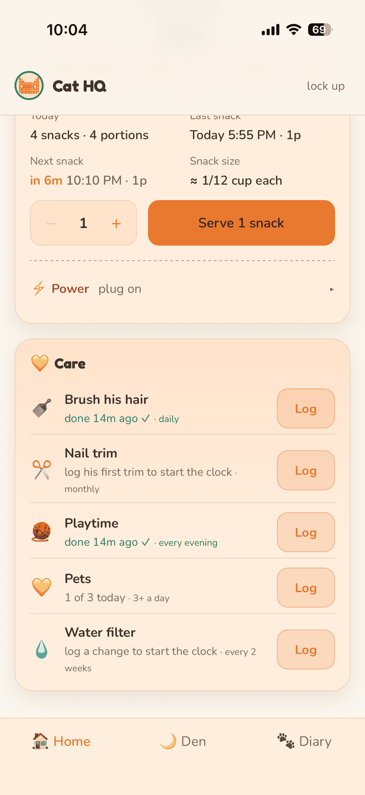
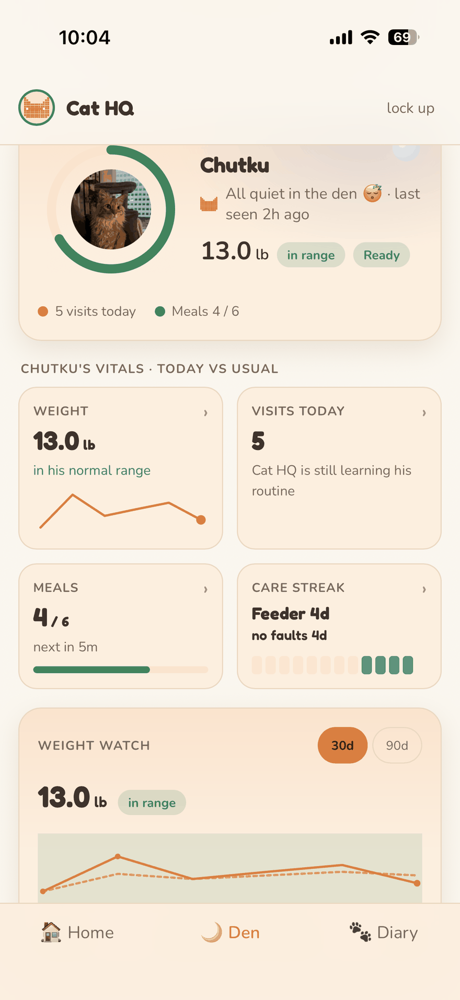
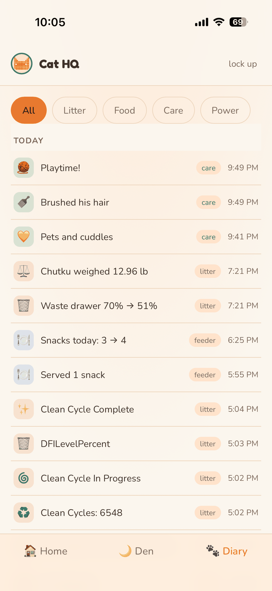

# Cat HQ

One custom app to monitor and care for my cat **Chutku** and
his devices: Litter-Robot 4, Petlibro Granary food
machine, Govee smart plugs for remote mains power/restart, and a Tapo camera. It's a mobile
PWA in a warm-cream "den" style with Chutku's real photos and an animated
mascot — live status + controls (Home, with his mood, reminders, and an
owner care log), an insights dashboard (🌙 Den), and an event Diary.

Project docs (brief / architecture / integrations / roadmap / testing / specs)
live in `docs/`. **M0–M5.7 built** (backend, data layer, live API, dashboard,
Govee power control, insights + mood + care). 

## Screenshots

<table>
  <tr>
    <td align="center" width="33%">
      <br>
      <sub><b>Home</b> · the mascot reads the room, plus what needs you</sub>
    </td>
    <td align="center" width="33%">
      <br>
      <sub><b>Litter Box</b> · live gauges + one-tap scoop</sub>
    </td>
    <td align="center" width="33%">
      <br>
      <sub><b>Food Machine</b> · schedule, serve, hold&#8209;to&#8209;restart power</sub>
    </td>
  </tr>
  <tr>
    <td align="center" width="33%">
      <br>
      <sub><b>Care</b> · the human's side of the job</sub>
    </td>
    <td align="center" width="33%">
      <br>
      <sub><b>🌙 Den</b> · today vs his own normal</sub>
    </td>
    <td align="center" width="33%">
      <br>
      <sub><b>Diary</b> · one timeline for everything</sub>
    </td>
  </tr>
</table>

## How this app was made (build notes)

- **Docs-driven, milestone-gated.** Five living documents in `docs/` (brief,
  architecture, integrations, roadmap, testing spec) steer every session; work
  resumes at the roadmap's first unchecked box and each milestone has explicit
  acceptance criteria — several requiring the owner to physically watch the
  hardware (first clean cycle, the mains Restart drill).
  
- **Architecture:** one always-on home box runs Docker Compose with two
  services — a Python 3.12 **FastAPI** backend (async adapters + pollers,
  REST + WebSocket, serves the built PWA) and **go2rtc** for camera video
  (M6). **SQLite** (WAL, SQLAlchemy async) holds the event log, state
  snapshots, and owner care log. Remote access will be Tailscale (M7) — no
  open ports, ever.
  
- **Adapter pattern for breakable clouds.** Whisker (`pylitterbot`) and
  Petlibro (client ported from the open-source Home Assistant integration)
  are reverse-engineered vendor APIs; Govee is official-but-cloud. Every
  adapter implements `get_state / execute / health`, polls ~60s with jitter +
  exponential backoff, and **fails loudly** (health badges, never silent
  staleness). Any dead adapter can be swapped for a Home Assistant-backed one
  without touching the rest.
  
- **Event log as the single source of history.** A recorder diffs adapter
  state every ~60s into normalized events and idempotently ingests vendor
  history every ~10 min (UNIQUE dedupe keys). Everything downstream — Diary,
  insights, mood, reminders, care — reads the same `GET /events`.
  
- **Live UI:** React + Vite PWA; one REST snapshot for first paint, then a
  WebSocket hub pushes per-device refreshes (LR4 cloud push propagates in
  seconds). Auth is a single bearer token; the backend refuses to boot with a
  default token.
  
- **Zero-dependency frontend by design.** All charts and characters are
  hand-rolled SVG + CSS: goal rings, sparklines with normal bands, gauges,
  the pixel cat, and the animated ChutkuCat mascot. Two self-hosted OFL fonts
  (Fredoka/Nunito). Precache budget < 300 KB, `prefers-reduced-motion`
  respected everywhere, ≥44px touch targets.
  
- **Honest-data discipline.** All time bucketing is explicit
  America/Los_Angeles (DST-tested); LR4 per-visit weights are outlier-filtered
  then median-smoothed before anything is flagged; colors mean
  inside/outside *Chutku's own normal band*, never naive up=good; cold-start
  states say "Cat HQ is still learning" instead of guessing; vendor quirks
  (lazy `pet_weight_lbs` timestamps, single-session Petlibro auth, Govee rate
  limits) are documented in `docs/02` as they're discovered against live data.
  
- **Safety rules are structural.** Secrets only in `.env`, enforced by a
  pre-commit hook; mains power (plugs) demands exact-name device binding,
  single-flight commands, hold-to-confirm UI, and loud failure ("plug may
  still be OFF"); no automation ever touches a power command; E2E scripts are
  read-only by design after a hard lesson (an auth probe once fired a real
  clean cycle).
  
- **Tests land with the code.** Backend: pytest, in-process ASGI + in-memory
  SQLite, vendor clouds mocked at the client boundary (295 tests). Frontend:
  vitest + testing-library (245 tests). Plus read-only Playwright smoke +
  HTTP checks against the live container. Screenshots go to the owner for
  approval before any deploy that changes the look.
  
- **Built with Claude Code.** Claude wrote the code, ran builds/tests/deploys,
  and verified against the live container; the owner directed the product
  (naming, themes, care routines), approved every look from screenshots, and
  watched the hardware for anything physical. Roughly a weekend from empty
  repo to this — the roadmap estimated 100–160 solo hours.

## Quickstart

Prereqs: Docker + Docker Compose on the home box (or your PC while developing).

```bash
cp .env.example .env        # fill in credentials; generate CATHQ_AUTH_TOKEN
docker compose up -d --build
curl http://localhost:8000/health
```

Then open `http://<box-ip>:8000` from any device on the LAN and paste the
`CATHQ_AUTH_TOKEN` value at the login screen. On a phone, use "Add to Home
Screen" to install the dashboard as an app. (Service-worker offline support
needs HTTPS and arrives with the Tailscale setup at M7.)

The backend image builds the frontend too (multi-stage) — `docker compose up
-d --build` is the whole deploy.

## Frontend dev loop

```bash
cd frontend
npm install
npm run dev        # Vite on :5173, proxies /devices /events /health /ws → :8000
```

## Testing

Unit suites live next to the code they test (spec: `docs/04-TESTING.md`).
Tests never touch vendor clouds and never move hardware — everything runs
in-process against fakes.

```bash
# backend (pytest; deps install via the [test] extra, never into the image)
cd backend && pip install -e '.[test]' && pytest

# frontend (vitest + testing-library)
cd frontend && npm install && npm test
```

Current baseline: backend 295, frontend 245 unit tests green.

E2E stays manual and read-only against the running container:
`scripts/verify_m5.sh` (17 HTTP/WS checks) and `node scripts/smoke.cjs`
(Playwright browser smoke — read-only checks across Home, the 🌙 Den, the
Diary, and the care cards; install Playwright OUTSIDE `frontend/`).

## Layout

    docker-compose.yml     backend + go2rtc services
    .env.example           every config/credential variable, documented
    backend/               FastAPI app (Python 3.12); serves the built PWA
    frontend/              React + Vite PWA (TypeScript)
    go2rtc/go2rtc.yaml     video restreamer config (wired up for real at M6)
    data/                  created at runtime; SQLite lives here from M3

## Secrets & publishing safety

Rules that keep credentials out of git — they apply to every future change:

- Real values live **only in `.env`** (gitignored; verified never-tracked
  against full history on 2026-07-05). `.env.example` documents every
  variable with **empty** values — adding a config variable means adding an
  empty, commented line there, never a real value.
  
- A committed **pre-commit hook** enforces this mechanically. Enable it once
  per clone (git does not auto-install hooks):

      git config core.hooksPath scripts/githooks

  It blocks: staging any `.env*` file (except `.env.example`), non-empty
  TOKEN/PASSWORD/EMAIL values in `.env.example`, and any staged content
  containing an actual secret value from your local `.env`. It prints
  variable names only, never values.
  
- The backend **refuses to start** if `CATHQ_AUTH_TOKEN` is empty or still
  the placeholder — a default token in a public repo must never gate
  hardware.
  
- Never paste `.env` contents into logs, issues, or chats.

- Published **public** at `github.com/Nikku2204/Cat-HQ` (owner decision,
  2026-07-07) after the pre-push checklist: `git ls-files | grep -i '\.env'`
  shows only `.env.example`, and the full history was scanned for secret
  values (clean — the only token-like string ever committed is the inert
  `change-me` placeholder). Note: `backend/app/adapters/petlibro/` is a
  GPL-3.0-attributed port (fine to publish; mind the license if the repo's
  own license ever changes).


## Working agreement

Claude writes code and may run builds/tests/curl checks; physical device
actions (feed, clean cycle) only happen with the owner watching. Secrets only
ever go in `.env` (gitignored), documented in `.env.example`.
